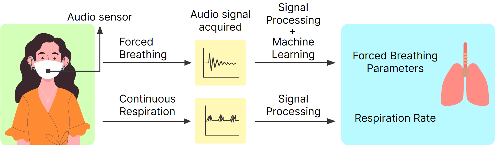

## SpiroMask: Measuring Lung Function Using Consumer-Grade Masks

**Anonymised repository for paper submitted for peer review at ACM HEALTH (October 2021)**.

This repository contains codes to reproduce the figures and results. The folders are divided into *Forced Breathing* and *Tidal Breathing* The description of each file is mentioned below. 

**Forced Breathing**
- ``script-1-generate-dataframe-envelope-and-its-features.ipynb``: Use this file to generate acoustic features of forced breathing. The generated data will be stored as a dictionary in a pickle file.
- ``script-2-generate-features.ipynb``: This file generates the flow-volume (FV) curve for each forced breathing audio file. Thereafter, statistical and temporal features are generated for each of the FV curve. The generated data will be stored as a dictionary in a pickle file.
- ``script-3-[parameter-name]-estimation-old.ipynb``: This notebook depends on the generated pickle file from the above notebooks. Generated the final result as well as *Figure 9*, *Figure 10*, *Figure 11*, *Figure 12* of the paper. 

**Tidal Breathing**
- ``spiroMask-nn-classifier.ipynb``: Classifies between 'Tidal Breathing', 'Noise' and 'Speech'. 
- ``tidal.ipynb``: Depends on the data classified as 'Tidal Breathing' from the the ``spiroMask-nn-classifier.ipynb``. Uses the accelerometer data and tidal breathing data to extract respiration rate. All data files are 20 second long.

Please note that the data will be made available at camera ready. Once can generate synthetic demo data to test the algorithms. 

